# VLSI Physical Design
Design complexity
Tools: Cadence Innovus, Synopsys

## Introduction to Physical Design Automation

Front-End Design
Back-End Design
> Moore's Law : "Predicted that *the number of transistors* of the basic components that you can pack inside a single integrated cicuit would be doubling **every eighteen months**".

### Design Flow
Setting block level constraints,which are mainly:
1. **Physical Constraints:** These constraints depends on the floor-plan, where exactly a particular block is placed on the top level.
        1. Size and shape of the block
        2. Pin placement within the block

Some of the physical constraints ar listed below:
- Die Area
- Core placement area
- Utilization area
- Aspect Ratio
- Cell Loaction
- Pin Loaction
- Wiring Keepout

2. **Timing Constraints:** Delays

```mermaid
graph TB
    subgraph Physical Design
    A("Import Design <br/> (.sdc,.def, .lib, .lef)") --> B(Floor-planning)
    B --> C(Placement)
    C --> D(Placement Optimization)
    D --> E(Clock Tree Synthesis)
    E --> F(Routing)
    F --> G(Routing Optimization)
    G --> H(Timing Closure)
    H --> I(Layout)
    I --> J("Physical Verification <br/> (DRC, LVS, ERC)")
    J --> K(GDSII)
    end
    subgraph VLSI Flow
    a1(Definition and Planning) --> a2(Design Verification)
    a2 --> a3(Logical Synthesis)
    a3 --> a4(Physical Design)
    a4 --> a5(Sign-off and Tapeout)
    a5 --> a6(Silicon Validation)
    end
    subgraph Design and Verification
    b1("RTL <br/> (Register Transfer Level) Design") --> b2(Integration/Development of IPs)
    b2 --> b3(RTL Synthesisability checks)
    b3 --> b4(Functional Verification)    
    end
    subgraph Synthesis
    c1(Synthesis- obtain gate level netlist) --> c2(Mapping)
    c2 --> c3(Optimization)
    c3 --> c4(Post Synthesis checks)
    c4 --> c5(Gate-level simulation)
    c4--> c6(Formal verification - Logic Equivalence)
    c4 --> c7(Static timing Analysis STA)
    c4 --> c8(Power/Area estimation)
    end

```

## Floorplanning and Placement
## Routing
## Static timing Analysis
## Signal Integrity and crosstalk issues
## Clocking issues and clock tree synthesis
## Low power deign issues
## Noise analysis and layout compaction
## Physical verification and sign-off
